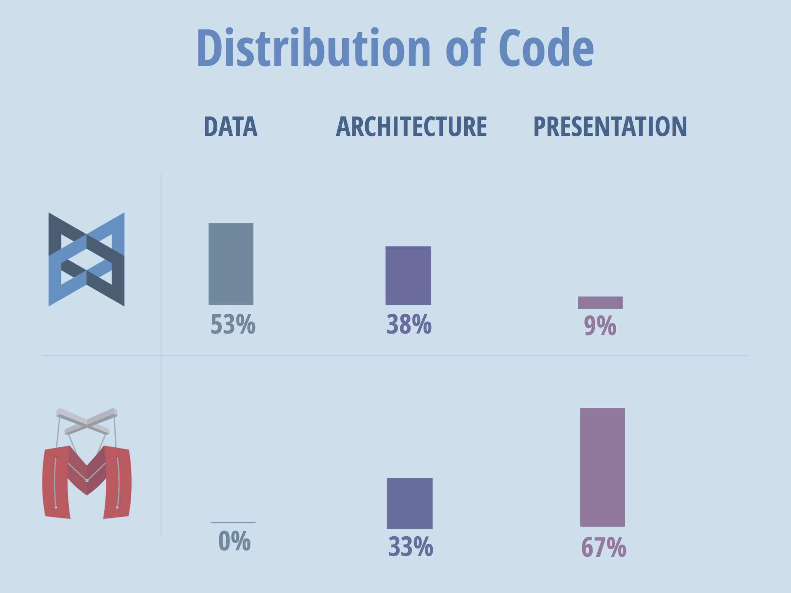

# Pourquoi _Marionette_ ?

Créer de larges applications web à l'aide de [Backbone.js][backbone] peut s'avérer difficile. _Backbone_ est un outil magnifique, mais il a été défini pour être minimaliste, utilisé pour une répondre aux situations les plus diverses. Dès lors, vous aurez moins d'aide et de support de sa part, surtout lorsque votre application tend à grossir, que des _framework_ plus "dogmatiques" tel que [Angular][angular] ou [Ember][ember].  Quand une application Backbone prend de l'ampleur, la maintenir requiert d'y ajouter une structure, soit grâce à une série de conventions et de composants personnalisés, soit basé sur le _framework_ d'un tiers. Il existe e nombreux _framework_ Backbone, mais nous pensons que vous saurez apprécier utiliser [Marionette.js][marionette].  

###  Décisions, Décisions

Développer avec _Backbone_ est un exercice de prise de décisions. _Backbone_ vous apporte un jeu minimaliste de `Models` et de `Collections` servant principalement d'enveloppe légère autour d'objets JavaScript, synchronisés via _Ajax_. Il vous propose des `View` légères associant une série de données avec un nœud du _DOM_. Il dispose d'un `Router` associant des _URLs_ à des fonctions, il dispose de méthodes utilitaires pour gérer par des événements toutes ces options. Ce qui laisse aux développeurs beaucoup de questions en suspens…

- **Comment afficher les `Views`?** - Par défaut, la méthode `render` de _Backbone_ n'a pas d'implémentation. Pour l'utiliser, vous devrez la produire vous même.
  + Cela peut passer par l'usage d'un moteur de _templates_ tel qu'_Underscore_ ou _Handlebars_, des manipulations du DOM via _jQuery_, ou des insertions de chaines avec `.innerHTML()`.
  + Vous pouvez utiliser la même méthode sur chaque `View`, ou mélanger l'ensemble de ces méthodolgies.
- **Comment gérez-vous les relations inter-objets ?** - Par défaut _Backbone_ permet de relier une série de `Models` en `Collection`, mais il ne dispose d'aucun principe de gestion de l'imbrication des `Models` ou des `Collections`. Et si vous souhaitez encapsuler vos `Views`, vous vous retrouverez totalement seul.
  + Vous pourrez avoir une `View` gérer des sous `Views`,
  + avoir un objet pivot gérer toutes les `Views`,
  + ou laisser chaque `View` s'autogérer.
- **Comment vos `Views` communiquent-elles ensemble ?** - Les `Views` ont souvent besoin d'échanger entre-elles. Si par exemple, une `View` a besoin de changer de contenu d'une autre zone de la page,
  + elle peut le faire directement via _jQuery_,
  + peut également disposer d'une référence directe à la `View` qui manipule cette zone et appeler une fonction dessus,
  + peut aussi modifier un `Model` écouté par une autre `View`,
  + faire appel à une _URL_ écouté par le `Router`,
  + ou encore soumettre une événement auquel une autre `View` peut répondre. Chaque application peut utilier une combinaison de toutes ces méthodes.
- **Comment éviter les duplications de code ?** - Si vous êtes inattentionné, votre projet _Backbone_ risque de se transformer en code spaghetti.
  + Si vous adoptez une approche naive, vous finirez par écrire le code de l'affichage, le code de gestion des `View` et de la gestion événementielle, encore et toujours pour chaque `View`.
  + Si vous tentez de contourner cela via l'héritage, vous allez obtenir une structure fragile, nécessitant des appels aux _prototype_ des `Views` afin d'activer une portion de code spécifique.
  + Eviter ce genre de répétitions, sans compter le surplus de maintenance relève du _challenge_.
- **Comment gérez-vous le cycle de vie des `View` ?**
  + Quel code est responsable de l'affichage d'une `View` ?
  + Est-ce qu'elle s'affiche elle-même à sa création ? Ou est-ce la responsabilité de l'objet qui la crée ?
  + Est-ce qu'elle est insérée dans le _DOM_ immediatement ? Ou est-ce une étape séparée ?
  + Lorsque que la vue sera ôtée du _DOM_ ou supprimée, quelle procédure se charge du nettoyage des dépendances ?
- **Comme,nt structurez-vous votre application ?** - Comment démarrez votre application ?  
  + Disposez-vous d'un objet centrale qui lance tout
  , ou est-ce réparti ?
  + Dans le ca d'une centralisation, utilisez-vous le `Router` comme amorce, ou d'autres objets pour activer les  codes ?
- **Comment vous prémunissez-vous des fuites mémoire ?** - Si votre application est une [_Single Page Application_][spa] ou qu'elle fait persister de longues sessions interactives, un nouveau problème émerge, car vous allez devoir gérer la mémoire. Il est relativement simple de créer des _"zombie Views"_ avec _Backbone_ si vous êtes inattentif aux événements attachés à une `View` après en avoir fini avec elle.

Il s'agit d'un petit échantillon du type de décisions à prendre pour faire un projet _Backbone_. Ces questions mènent à la flexibilité, et confèrent une surcharge intellectuelle. Si vous êtes comme moi, vous voyez ces problèmes courants et sachez que vous obtiendrez de meilleurs résultats en réutilisant le savoir des expériences de la communauté.

### Qu'est-ce que _Marionette_ vous propose ?

_Marionette_ est une tentative de mise en place d'une solution commune, jeu de composants et de _design patterns_, conservant les meilleures pratiques de _Backbone_. Donc que vous est-il proposé ? Quel est sa plus value ?

_Marionette_ vous propose :

- **Un processus de rendu graphique standardisé**  
  + _Marionette_ devient rigoureux sur la façon de restituer les `Views`. Sans configuration supplémentaires, il utilise un _template_ conservé en tant que propriété d'une `View`, la compile à l'aide de la fonction `_.template()` d'_Underscore_ et lui injecte les valeurs d'un `Model` ou d'une `Collection`.  
  + Si vous avez besoin d'autres données, ou souhaitez utiliser un autre outil de _templating_ côté client, _Marionette_ expose une _API_ pour vous approprier ce procédé, de la façon la plus [DRY][dry] que possible.
- **Un cycle de vie des `Views` cohérent**
  + _Marionette_ définit un cycle de vie cohérent pour les `Views`, qu'elles soient initialisées, rendues, affichées, raffraichies, et détruites.  
  + Toutes ces étapes sont accompagnées d'événements et de `callbacks` associés, mais surtout tout le code spaghetti est produit par derrière, en coulisse.
- **La possibilité de gérer la complexité de l'affichage** -
  + _Marionette_ dispose d'objets régions, définissant des portions de _DOM_ qui permettent l'affichage et la permutation de `Views`.
  + Combiné avec des utilitaires de gestion des sous-vues, vous pouvez créer simplement des structures imbriquées de `Views` très complexes, tout en minimisant la complexité générale.
- **Un _event bus_ centralisé, plus des événements sémantiques pour simplifier la communication entre `Views`** - _Marionette_ inclus _Backbone.Wreqr_ ou _Backbone.Radio_ comme un _event bus_ pour permettre une communication inter-vues sans découplage explicite.  
- **Helpers to help you write DRY Code** - In addition to centralizing the rendering and view management code, Marionette provides hooks to allow you to abstract away details of the DOM and events in your View code, and a mechanism to pull common ui operations out into separate reusable objects
- **Des fonctions utilitaires pour éviter les "Zombie Views" et fuites mémoire** - Le cycle de vie de _Marionette_  inclus des phases de destruction explixites pour nettoyer les sources les plus fréquentes de fuite de mémoire, et propose une _API_ pour vous occuper du reste.
- **Un object `Application` centralisé pour gérer l'initialisation de vos applications** - En utilisant _Marionette_, vous serez apte à spécifier un jeu d'_initializers_ permettant de lancer n'importe quel code à excécuter avant que votre application ne démarre, conférant une structure éfficace et un point d'entrée à votre application.

Ce ne sont pas que les seules fonctions possibles, mais les principes fondamentaux les plus vendeurs. Le plus important étant de comprendre que _Marionette_ est un _framework_ pour construire des application _Backbone_ à partir des recettes les plus éprouvées de la communauté.

*Cette explication est librement adaptéd'un billet de blogd'un membre de la communauté _Marionette_. Vous trouverez l'original [ici][caseformn]*.

## En résumé, _Marionette_ est un complément de _Backbone_

_source
James Smith http://fr.slideshare.net/JamesSmith158/bbconf-2014_

[marionette]:http://marionettejs.com
[backbone]: http://backbonejs.org
[ember]: http://emberjs.com
[angular]:https://angularjs.org
[spa]:http://en.wikipedia.org/wiki/Single-page_application
[dry]:http://en.wikipedia.org/wiki/Don%27t_repeat_yourself
[caseformn]: http://benmccormick.org/2014/12/02/the-case-for-marionette-js
